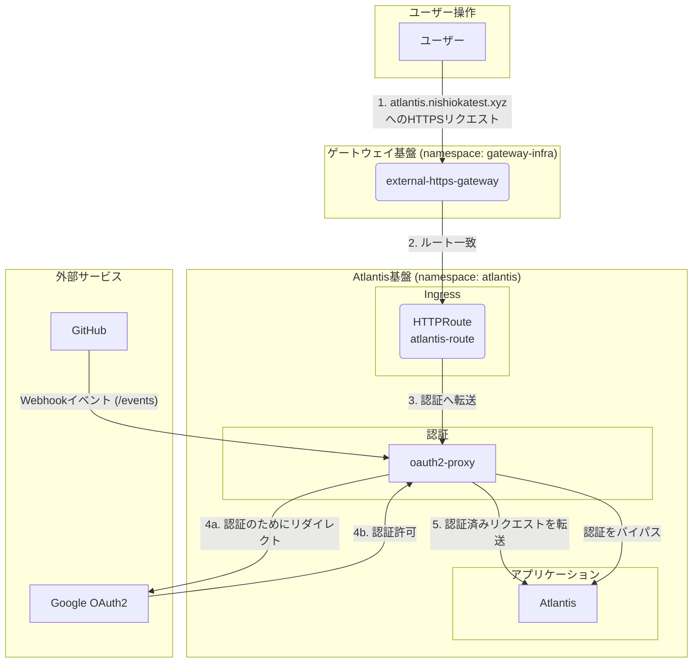

# GKE上のAtlantis
このドキュメントは、`k8s/gcp/atlantis/` 配下で管理されている、GKEにAtlantisをデプロイするために使用されるKubernetesリソースの概要を説明します。

## アーキテクチャ概要
この構成では、`oauth2-proxy` を使用してGoogle OAuth2経由で認証を行い、その後トラフィックをAtlantisアプリケーションに転送します。すべてのリソースは `atlantis` 名前空間内にデプロイされます。IngressはKubernetes Gateway APIの一部である `HTTPRoute` リソースによって管理されます。

## リソース関連図

## リソース詳細
### 1. Namespace (`namespace.yaml`)
- 関連するすべてのリソースがデプロイされる `atlantis` 名前空間を定義します。

### 2. Ingress (`http-route.yaml`)
- `atlantis-route` という名前の `HTTPRoute` リソースです。
- `atlantis.nishiokatest.xyz` のトラフィックを管理します。
- `gateway-infra` 名前空間にある `external-https-gateway` という名前の `Gateway` に関連付けられています。
- すべての着信トラフィックは `oauth2-proxy` サービスにルーティングされます。

### 3. 認証 (`oauth2-proxy/`)
- **Helm Release (`helm-release.yaml`):** 公式のHelmチャートを使用して `oauth2-proxy` をデプロイします。
- **機能:** フォワード認証プロキシとして機能します。Googleに対してユーザーを認証し、有効なリクエストをAtlantisサービスに転送します。
- **設定:**
    - UpstreamはAtlantisの内部サービスURLに設定されています: `http://atlantis.atlantis.svc.cluster.local`。
    - GoogleがOIDCプロバイダーとして設定されています。
    - アクセスは特定のGoogleアカウントリストに制限されています。
    - GitHubのWebhookパス (`POST /events`) の認証をバイパスします。
    - シークレット（クライアントID、クライアントシークレット、クッキーシークレット）は `oauth2-proxy-google-secret` という名前のKubernetes Secretを介して管理されます。
- **ヘルスチェック (`health-check-policy.yaml`):**
    - GKE固有の `HealthCheckPolicy` が設定されています。
    - `oauth2-proxy` サービスを対象とし、ポート `4180` の `/ping` エンドポイントをチェックします。

### 4. コアアプリケーション (`atlantis/`)
- **Helm Release (`helm-release.yaml`):** 公式のHelmチャートを使用してAtlantisをデプロイします。
- **設定:**
    - **サービスアカウント:** GCPサービスアカウント (`atlantis-terraform-executer@...`) を使用して、AtlantisがGCPに対してTerraformを実行するために必要な権限を付与します。これはGKEのWorkload Identity機能によって実現されます。
    - **VCS連携:** GitHub Appと連携するように設定されています。`atlantis-github-secret` という名前のKubernetes Secretを使用して、必要な認証情報（App ID、秘密鍵、Webhookシークレット）を保存します。
    - **URL:** 外部URLは `https://atlantis.nishiokatest.xyz` に設定されています。
    - **Ingress:** チャートに組み込まれているIngressは、`HTTPRoute` と `oauth2-proxy` の構成を優先して無効になっています。

### 5. オーケストレーション (`kustomization.yaml`)
- ルートの `kustomization.yaml` ファイルが、上記すべてのリソース（`namespace`, `http-route`, `health-check-policy`, `atlantis` release, `oauth2-proxy` release）をまとめてFluxCDによるデプロイを可能にします。
