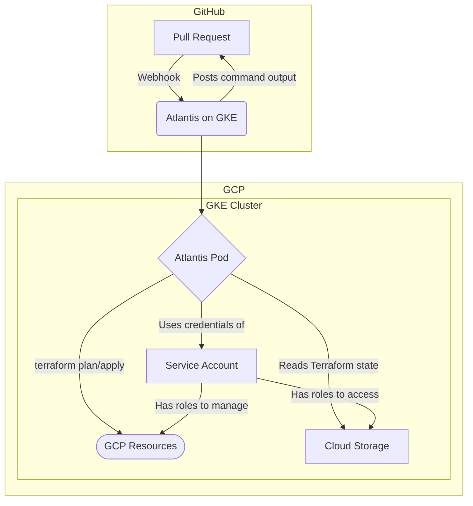

# Atlantis on GKE

This document describes how to set up and manage Atlantis on Google Kubernetes Engine (GKE).

## 1. Overview

Atlantis is a tool for automating Terraform via pull requests. By integrating Atlantis with your version control system (e.g., GitHub), you can run `terraform plan` and `terraform apply` remotely and have the output posted back to the pull request.

This setup runs Atlantis within a GKE cluster, leveraging other GCP services for robust and scalable automation.

## 2. Architecture

The following diagram illustrates the components and their interactions.



### Components

*   **GitHub**: Where developers open pull requests with Terraform changes.
*   **GKE (Google Kubernetes Engine)**: Hosts the Atlantis application.
    *   **Atlantis Pod**: A container running the Atlantis server. It receives webhooks from GitHub and executes Terraform commands.
    *   **Service Account**: A Kubernetes service account, associated with a GCP service account, that has permissions to manage GCP resources and access the Terraform state in Cloud Storage.
*   **Cloud Storage**: Stores the Terraform state files (`.tfstate`).
*   **GCP Resources**: The infrastructure managed by Terraform (e.g., Compute Engine, Cloud SQL).

## 3. Setup

### Prerequisites

*   `gcloud` CLI installed and authenticated.
*   `kubectl` installed and configured to connect to your GKE cluster.
*   `terraform` installed.

### Step 1: Create GCP Resources

You need a GKE cluster, a Google Cloud Storage (GCS) bucket for Terraform state, and an IAM Service Account for Atlantis to use.

#### 1.1. Set Environment Variables

First, set some environment variables to make the next commands easier.

```bash
export PROJECT_ID=$(gcloud config get-value project)
export CLUSTER_NAME="atlantis-cluster"
export REGION="us-central1"
export GCS_BUCKET_NAME="atlantis-tf-state-${PROJECT_ID}"
export GSA_NAME="atlantis-sa"
export GSA_EMAIL="${GSA_NAME}@${PROJECT_ID}.iam.gserviceaccount.com"
```

#### 1.2. Create GKE Cluster

Create a regional GKE cluster.

```bash
gcloud container clusters create ${CLUSTER_NAME} \
  --region ${REGION} \
  --num-nodes=1 \
  --machine-type=e2-medium \
  --workload-pool=${PROJECT_ID}.svc.id.goog
```

Get credentials for `kubectl`.

```bash
gcloud container clusters get-credentials ${CLUSTER_NAME} --region ${REGION}
```

#### 1.3. Create GCS Bucket

Create a GCS bucket to store Terraform state files.

```bash
gsutil mb -p ${PROJECT_ID} gs://${GCS_BUCKET_NAME}
gsutil versioning set on gs://${GCS_BUCKET_NAME}
```

#### 1.4. Create IAM Service Account

Create a GCP Service Account (GSA) for Atlantis.

```bash
gcloud iam service-accounts create ${GSA_NAME} \
  --display-name="Atlantis Service Account"
```

Grant the service account permissions to manage GCP resources (e.g., `roles/editor`) and the GCS bucket (`roles/storage.admin`). **Note: For production, you should use more fine-grained permissions.**

```bash
# Permission to manage resources
gcloud projects add-iam-policy-binding ${PROJECT_ID} \
  --member="serviceAccount:${GSA_EMAIL}" \
  --role="roles/editor"

# Permission for the GCS state bucket
gsutil iam ch serviceAccount:${GSA_EMAIL}:objectAdmin gs://${GCS_BUCKET_NAME}
```

Allow the Kubernetes Service Account (KSA) in the `default` namespace to impersonate the GCP Service Account (GSA).

```bash
gcloud iam service-accounts add-iam-policy-binding ${GSA_EMAIL} \
  --role roles/iam.workloadIdentityUser \
  --member "serviceAccount:${PROJECT_ID}.svc.id.goog[default/default]"
```

### Step 2: Deploy Atlantis to GKE

Now, deploy Atlantis to the GKE cluster.

#### 2.1. Create GitHub Credentials

You need a GitHub personal access token (PAT) and a webhook secret.

1.  **Personal Access Token**: Create a token with `repo` scope. See the [GitHub documentation](https://docs.github.com/en/authentication/keeping-your-account-and-data-secure/creating-a-personal-access-token).
2.  **Webhook Secret**: Generate a strong random string. You can use `openssl rand -hex 16` to generate one.

Store these as Kubernetes secrets.

```bash
kubectl create secret generic atlantis-github-creds \
  --from-literal=token='YOUR_GITHUB_PAT' \
  --from-literal=webhook-secret='YOUR_WEBHOOK_SECRET'
```

#### 2.2. Create `atlantis-deployment.yaml`

Create a file named `atlantis-deployment.yaml` with the following content. This manifest defines the `ServiceAccount`, `Deployment`, and `Service` for Atlantis.

*   The `serviceAccount` is annotated to use Workload Identity.
*   The `Deployment` mounts the GitHub credentials from the secret.
*   The `Service` exposes Atlantis on port 80, ready for an Ingress controller.

```yaml
# atlantis-deployment.yaml
apiVersion: v1
kind: ServiceAccount
metadata:
  name: default
  annotations:
    iam.gke.io/gcp-service-account: atlantis-sa@${PROJECT_ID}.iam.gserviceaccount.com # Replace ${PROJECT_ID}

---
apiVersion: apps/v1
kind: Deployment
metadata:
  name: atlantis
spec:
  replicas: 1
  selector:
    matchLabels:
      app: atlantis
  template:
    metadata:
      labels:
        app: atlantis
    spec:
      serviceAccountName: default
      containers:
      - name: atlantis
        image: ghcr.io/runatlantis/atlantis:v0.23.4 # Use a specific version
        env:
        - name: ATLANTIS_GH_USER
          value: "your-github-username" # Replace with your GitHub username
        - name: ATLANTIS_GH_TOKEN
          valueFrom:
            secretKeyRef:
              name: atlantis-github-creds
              key: token
        - name: ATLANTIS_GH_WEBHOOK_SECRET
          valueFrom:
            secretKeyRef:
              name: atlantis-github-creds
              key: webhook-secret
        - name: ATLANTIS_REPO_ALLOWLIST
          value: "github.com/your-org/*" # Adjust to your organization/repo
        # GCP specific settings
        - name: ATLANTIS_WRITE_GIT_CREDS
          value: "true"
        - name: GOOGLE_PROJECT
          value: ${PROJECT_ID} # Replace ${PROJECT_ID}
        # Atlantis server settings
        - name: ATLANTIS_DATA_DIR
          value: "/atlantis"
        - name: ATLANTIS_PORT
          value: "4141"
        ports:
        - name: atlantis
          containerPort: 4141
---
apiVersion: v1
kind: Service
metadata:
  name: atlantis
spec:
  type: ClusterIP
  selector:
    app: atlantis
  ports:
  - name: http
    port: 80
    targetPort: atlantis
```

**Note:** Before applying, replace `${PROJECT_ID}` and other placeholders in the YAML file.

#### 2.3. Apply the Manifest

```bash
kubectl apply -f atlantis-deployment.yaml
```

### Step 3: Configure GitHub Webhook

To receive webhooks from GitHub, you need to expose the Atlantis service to the internet. We'll use a GKE Ingress for this.

#### 3.1. Create a Static IP for the Ingress

Reserve a static external IP address.

```bash
gcloud compute addresses create atlantis-static-ip --global
```

Get the reserved IP address.

```bash
gcloud compute addresses describe atlantis-static-ip --global --format="value(address)"
```

#### 3.2. Create `ingress.yaml`

Create an `ingress.yaml` file. This manifest uses the static IP and assumes you have a domain and can set up DNS. If not, you can use the IP directly. It also references a managed SSL certificate.

```yaml
# ingress.yaml
apiVersion: networking.k8s.io/v1
kind: Ingress
metadata:
  name: atlantis-ingress
  annotations:
    kubernetes.io/ingress.global-static-ip-name: "atlantis-static-ip"
    networking.gke.io/managed-certificates: "atlantis-cert"
spec:
  rules:
  - host: atlantis.your-domain.com # Replace with your domain
    http:
      paths:
      - path: /
        pathType: Prefix
        backend:
          service:
            name: atlantis
            port:
              number: 80
---
apiVersion: networking.gke.io/v1
kind: ManagedCertificate
metadata:
  name: atlantis-cert
spec:
  domains:
    - atlantis.your-domain.com # Replace with your domain
```

Apply the Ingress manifest.

```bash
kubectl apply -f ingress.yaml
```

#### 3.3. Configure GitHub

1.  Go to your target GitHub repository's **Settings > Webhooks**.
2.  Click **Add webhook**.
3.  **Payload URL**: Enter `http://<YOUR_STATIC_IP>/events` or `https://atlantis.your-domain.com/events`.
4.  **Content type**: Select `application/json`.
5.  **Secret**: Enter the webhook secret you created earlier.
6.  **Which events would you like to trigger this webhook?**: Select "Let me select individual events." and choose:
    *   Issue comments
    *   Pull requests
    *   Pushes (if you use `apply` on merge)
7.  Click **Add webhook**.

## 4. Configuration

Atlantis can be configured via environment variables (as shown in the `Deployment` manifest) or via configuration files.

### Atlantis Server-side Configuration (`atlantis.yaml`)

For more advanced configurations, such as custom workflows, you can provide a server-side `atlantis.yaml` file.

1.  Create a `config.yaml` with your settings:
    ```yaml
    # config.yaml
    repos:
    - id: /.*/
      # Define a custom workflow
      workflow: my-workflow

    workflows:
      my-workflow:
        plan:
          steps:
          - init
          - plan:
              extra_args: ["-lock=false"]
        apply:
          steps:
          - apply:
              extra_args: ["-lock=false"]
    ```

2.  Create a ConfigMap from this file:
    ```bash
    kubectl create configmap atlantis-config --from-file=config.yaml
    ```

3.  Mount the ConfigMap as a volume in your `atlantis-deployment.yaml` and point to it with the `--config` flag.

### Repository-side Configuration

To configure Atlantis on a per-repository basis, add an `atlantis.yaml` file to the root of your Terraform repository. This is useful for specifying the Terraform version, project dependencies, and more.

Example `atlantis.yaml` in a repository:
```yaml
# atlantis.yaml in your terraform project repository
version: 3
projects:
- name: gcp-staging-infra
  dir: staging
  terraform_version: v1.1.0
  autoplan:
    when_modified: ["*.tf", "../modules/**/*.tf"]
    enabled: true
- name: gcp-prod-infra
  dir: prod
  workflow: my-prod-workflow # Assumes 'my-prod-workflow' is defined server-side
```

## 5. Operations

### Logging

Check the logs of the Atlantis pod in real-time:
```bash
kubectl logs -f -l app=atlantis
```

### Troubleshooting

*   **Permission Issues**:
    *   Check the IAM bindings for the GCP Service Account: `gcloud projects get-iam-policy ${PROJECT_ID}`.
    *   Ensure the `workloadIdentityUser` role is correctly bound between the KSA and GSA.
    *   Review Cloud Audit Logs for "permission denied" errors.
*   **Webhook Failures**:
    *   In GitHub, go to **Settings > Webhooks > Your Atlantis Webhook > Recent Deliveries**. Check the response body for errors.
    *   Ensure the Ingress IP is correct and the firewall isn't blocking traffic.
*   **Pod Errors / CrashLoopBackOff**:
    *   Check pod logs for configuration errors (e.g., bad environment variables).
    *   Use `kubectl describe pod <atlantis-pod-name>` to see events and potential reasons for failure.
