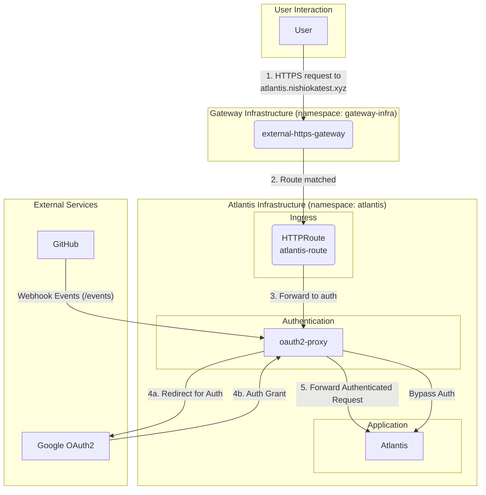

# Atlantis on GKE

This document outlines the Kubernetes resources used to deploy Atlantis on GKE, managed under `k8s/gcp/atlantis/`.

## Architecture Overview

The setup uses `oauth2-proxy` to handle authentication via Google OAuth2 before forwarding traffic to the Atlantis application. All resources are deployed within the `atlantis` namespace. Ingress is managed by a `HTTPRoute` resource, which is part of the Kubernetes Gateway API.

## Resource Relationship Diagram

## Resource Breakdown

### 1. Namespace (`namespace.yaml`)
- Defines the `atlantis` namespace where all related resources are deployed.

### 2. Ingress (`http-route.yaml`)
- A `HTTPRoute` resource named `atlantis-route`.
- Manages traffic for `atlantis.nishiokatest.xyz`.
- It's associated with a `Gateway` named `external-https-gateway` in the `gateway-infra` namespace.
- All incoming traffic is routed to the `oauth2-proxy` service.

### 3. Authentication (`oauth2-proxy/`)
- **Helm Release (`helm-release.yaml`):** Deploys `oauth2-proxy` using its official Helm chart.
- **Function:** Acts as a forward authentication proxy. It authenticates users against Google and then forwards valid requests to the Atlantis service.
- **Configuration:**
    - Upstream is set to Atlantis's internal service URL: `http://atlantis.atlantis.svc.cluster.local`.
    - Google is configured as the OIDC provider.
    - Access is restricted to a specific list of Google accounts.
    - It bypasses authentication for GitHub webhook paths (`POST /events`).
    - Secrets (client ID, client secret, cookie secret) are managed via a Kubernetes secret named `oauth2-proxy-google-secret`.
- **Health Check (`health-check-policy.yaml`):**
    - A GKE-specific `HealthCheckPolicy` is configured.
    - It targets the `oauth2-proxy` service and checks the `/ping` endpoint on port `4180`.

### 4. Core Application (`atlantis/`)
- **Helm Release (`helm-release.yaml`):** Deploys Atlantis using the official Helm chart.
- **Configuration:**
    - **Service Account:** Uses a GCP Service Account (`atlantis-terraform-executer@...`) to grant Atlantis the necessary permissions to execute Terraform against GCP. This is achieved via GKE's Workload Identity feature.
    - **VCS Integration:** Configured to work with a GitHub App. It uses a Kubernetes secret `atlantis-github-secret` to store the necessary credentials (App ID, private key, webhook secret).
    - **URL:** The external URL is set to `https://atlantis.nishiokatest.xyz`.
    - **Ingress:** The chart's built-in Ingress is disabled in favor of the `HTTPRoute` and `oauth2-proxy` setup.

### 5. Orchestration (`kustomization.yaml`)
- A root `kustomization.yaml` file ties all the above resources (`namespace`, `http-route`, `health-check-policy`, `atlantis` release, `oauth2-proxy` release) together for deployment via FluxCD.
