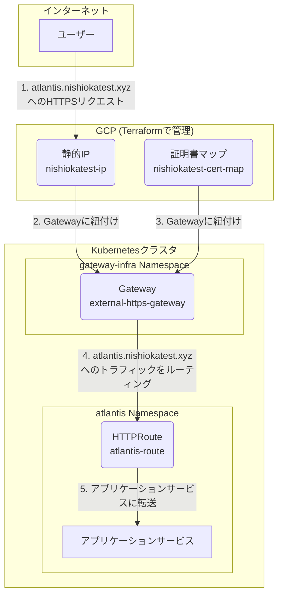

# GKE Gateway基盤
このドキュメントは、`k8s/gcp/gateway-infra/` 配下で管理されている、GKE Gateway APIの基盤となるリソースの概要を説明します。

## アーキテクチャ概要
この構成は、Kubernetes Gateway APIを利用して外部からのHTTPSトラフィックをクラスタ内のサービスにルーティングするための基本的なインフラを定義します。GKEの`gke-l7-global-external-managed` GatewayClassを使用し、Google Cloud ArmorやCertificate ManagerなどのGCPサービスと統合されたL7ロードバランサを作成します。

## リソース関連図

## リソース詳細
### 1. Namespace (`namespace.yaml`)
- `gateway-infra` という名前空間を定義します。
- この名前空間は、Gatewayリソースなど、クラスタ全体のルーティング基盤を他のアプリケーションから分離するために使用されます。

### 2. Gateway (`gateway.yaml`)
- `external-https-gateway` という名前の `Gateway` リソースです。
- **GatewayClass:** `gke-l7-global-external-managed` を指定しており、GKEが管理するグローバル外部HTTPSロードバランサを作成します。
- **Listener:** `atlantis.nishiokatest.xyz` というホスト名で、ポート `443` のHTTPSトラフィックをリッスンします。
- **Allowed Routes:** `atlantis` 名前空間からの `HTTPRoute` リソースのみを受け入れるように設定されています。これにより、どのアプリケーションがこのゲートウェイを使用できるかを制御します。
- **GCPリソース連携:**
    - **静的IP:** `networking.gke.io/addresses` アノテーションの代わりに `spec.addresses` フィールドを使い、Terraformで作成された `nishiokatest-ip` という名前の静的グローバルIPアドレスを関連付けます。
    - **証明書:** `networking.gke.io/certmap` アノテーションを使い、Terraformで作成された `nishiokatest-cert-map` という名前のGCP Certificate Managerの証明書マップを関連付けます。これにより、SSL/TLS終端が実現されます。

## オーケストレーション (`kustomization.yaml`)
- ルートの `kustomization.yaml` ファイルが、`namespace.yaml` と `gateway.yaml` をまとめてFluxCDによるデプロイを可能にします。
