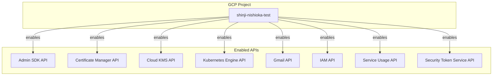

# GCP APIの有効化
このドキュメントは、`terraform/gcp/01-api/` 配下で管理されている、GCPプロジェクトで必要なAPIを有効化するためのTerraformリソースの概要を説明します。

## 概要
このTerraform構成は、特定のGCPプロジェクトに対して、後続のTerraformリソースやアプリケーションが機能するために必要となる各種Google Cloud APIを有効化する役割を担います。

## リソース関連図

## リソース詳細
### 1. APIの有効化 (`api.tf`)
- **リソース:** `google_project_service`
- **説明:** このリソースは、`for_each` ループを使用して、定義されたリスト内のすべてのAPIをプロジェクトで有効にします。`disable_dependent_services` を `true` に設定することで、サービス無効化時に依存サービスが自動的に無効になるのを防ぎます。
- **有効化されるAPIリスト:**
  - `admin.googleapis.com` (Admin SDK API)
  - `certificatemanager.googleapis.com` (Certificate Manager API)
  - `cloudkms.googleapis.com` (Cloud Key Management Service API)
  - `container.googleapis.com` (Kubernetes Engine API)
  - `gmail.googleapis.com` (Gmail API)
  - `iam.googleapis.com` (Identity and Access Management (IAM) API)
  - `serviceusage.googleapis.com` (Service Usage API)
  - `sts.googleapis.com` (Security Token Service API)

### 2. バックエンド設定 (`backend.tf`)
- **Terraformバックエンド:** GCS (Google Cloud Storage)
- **バケット:** `shinji-nishioka-test-terraform-state`
- **説明:** Terraformの状態ファイル (`.tfstate`) は、指定されたGCSバケットに保存されます。これにより、状態の永続化とチームでの共有が可能になります。
