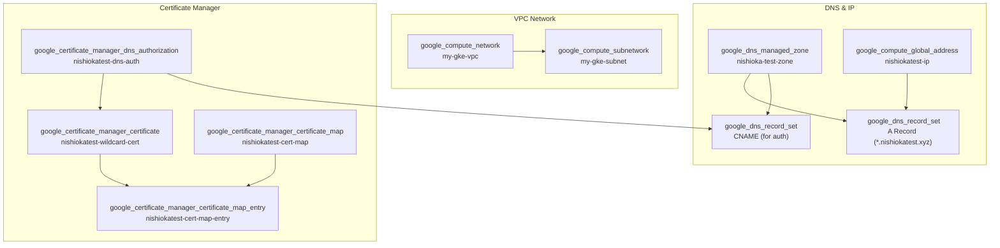

# GCP ネットワーク
このドキュメントは、`terraform/gcp/02-network/` 配下で管理されている、GCPのネットワーク関連リソースの概要を説明します。

## 概要
このTerraform構成は、GKEクラスタの稼働に必要となる基本的なネットワークインフラを構築します。具体的には、VPCとサブネットを作成し、Cloud DNSでドメインの名前解決を構成し、Google-managedのSSL証明書を発行してロードバランサで利用できるように準備します。

## リソース関連図

## リソース詳細
### 1. ネットワーク (`network.tf`)
- **リソース:**
  - `google_compute_network "vpc_network"`: GKEクラスタ用のカスタムVPC (`my-gke-vpc`) を作成します。サブネットは手動で作成するため、`auto_create_subnetworks` は `false` に設定されています。
  - `google_compute_subnetwork "gke_subnet"`: GKE Pod (`pods-range`) と Service (`services-range`) 用のセカンダリIPレンジを持つサブネット (`my-gke-subnet`) を作成します。

### 2. DNS (`dns.tf`)
- **リソース:**
  - `google_dns_managed_zone "nishioka_test_zone"`: `nishiokatest.xyz.` ドメインを管理するためのCloud DNSマネージドゾーンを作成します。
  - `google_compute_global_address "nishiokatest_ip"`: グローバル外部IPアドレスを静的に予約します。
  - `google_dns_record_set "a_record_wildcard"`: `*.nishiokatest.xyz` へのアクセスを、予約した静的IPアドレスに名前解決するためのワイルドカードAレコードです。
  - `google_dns_record_set "nishiokatest_auth_cname"`: Certificate Managerがドメインの所有権を確認するために使用するDNS認証用のCNAMEレコードを作成します。

### 3. 証明書 (`certificate_manager.tf`)
- **リソース:**
  - `google_certificate_manager_dns_authorization "nishiokatest_dns_auth"`: `nishiokatest.xyz` ドメインに対するSSL証明書発行の権限をDNS経由で承認するためのリソースです。
  - `google_certificate_manager_certificate "nishiokatest_wildcard_cert"`: `*.nishiokatest.xyz` に対するGoogleマネージドのワイルドカードSSL証明書を作成します。
  - `google_certificate_manager_certificate_map "nishiokatest_cert_map"`: 発行した証明書をロードバランサなどのターゲットにマッピングするためのコンテナです。
  - `google_certificate_manager_certificate_map_entry "nishiokatest_cert_map_entry"`: ワイルドカードホスト名 `*.nishiokatest.xyz` とワイルドカード証明書を証明書マップに紐付けます。

### 4. 出力 (`outputs.tf`)
- **説明:** 作成されたVPC (`google_compute_network`) とサブネット (`google_compute_subnetwork`) のオブジェクトをTerraformの出力として定義します。これにより、他のTerraformモジュールからこのネットワークリソースを参照できます。

## バックエンド設定 (`backend.tf`)
- **Terraformバックエンド:** GCS (Google Cloud Storage)
- **バケット:** `shinji-nishioka-test-terraform-state`
- **説明:** Terraformの状態ファイル (`.tfstate`) は、指定されたGCSバケットに保存されます。これにより、状態の永続化とチームでの共有が可能になります。
