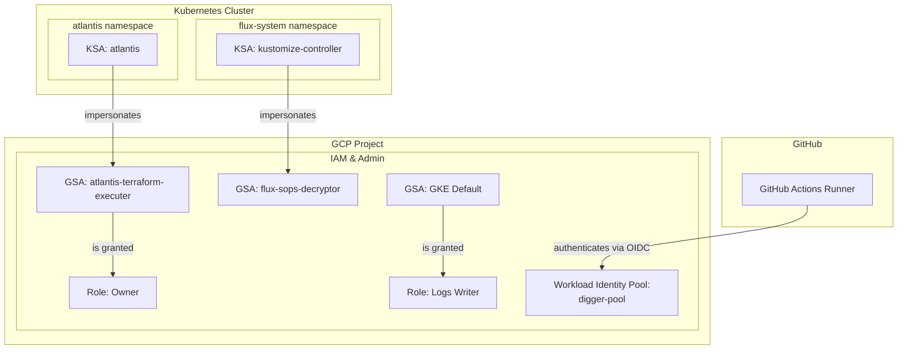

# IAMリソース (サービスアカウントと権限)
このドキュメントは、`terraform/gcp/03-iam/` 配下で管理されている、IAM関連リソースの概要を説明します。

## 概要
このTerraform構成は、主に以下の3つの目的のためのGoogleサービスアカウント(GSA)と、それに関連するIAM権限を設定します。
- **Atlantis:** Terraformコードを自動的に実行するためのサービスアカウント。
- **Flux:** Kubernetesクラスタ内のリソースを管理し、SOPSで暗号化されたシークレットを復号するためのサービスアカウント。
- **Digger:** GitHub Actions経由でTerraformコードを実行するためのサービスアカウント。

これらのサービスアカウントは、Kubernetesサービスアカウント(KSA)やGitHub ActionsとWorkload Identityを利用して連携し、GCPリソースへの安全なアクセスを実現します。

## リソース関連図

## リソース詳細
### 1. サービスアカウントとWorkload Identity (`iam.tf`)
- **リソース:** `google_service_account`
- **説明:** `for_each`を使用して、2つのGoogleサービスアカウントを作成します。
  - `atlantis-terraform-executer`: AtlantisがGCPリソースを管理するために使用します。
  - `flux-sops-decryptor`: FluxがSOPSで暗号化されたデータを復号するために使用します（例: KMSキーへのアクセス）。
- **リソース:** `google_service_account_iam_member`
- **説明:** 各GoogleサービスアカウントとKubernetesサービスアカウントを紐付け、Workload Identityを有効にします。これにより、Kubernetes Pod内のアプリケーションが、対応するGoogleサービスアカウントとしてGCP APIを認証・認可できるようになります。
  - `atlantis-terraform-executer` (GSA) <--> `atlantis/atlantis` (KSA)
  - `flux-sops-decryptor` (GSA) <--> `flux-system/kustomize-controller` (KSA)

### 2. IAMポリシー (`iam_policy.tf`)
- **リソース:** `google_project_iam_member`
- **説明:** `for_each` を使用して、複数のサービスアカウントにプロジェクトレベルのIAMロールを付与します。
- **付与されるロール:**
  - **`atlantis-terraform-executer` GSA:**
    - `roles/owner` (オーナー): AtlantisがTerraformを通じてプロジェクト内の全リソースを管理できるよう、広範な権限を付与します。
  - **GKE Default GSA:**
    - `roles/logging.logWriter` (ログ書き込み): GKEクラスタのノードがGoogle Cloud Loggingにログを書き込むための権限を付与します。

### 3. Digger用Workload Identity Pool (`iam_workload_identity_pool.tf`)
- **リソース:** `google_iam_workload_identity_pool`, `google_iam_workload_identity_pool_provider`
- **説明:** GitHub ActionsのOIDCトークンを信頼するWorkload Identity Poolとプロバイダーを設定します。これにより、特定のGitHubリポジトリ(`nishioka-shinji/my_infra`)からのActionsワークフローが、GCPサービスアカウントの権限を借用してGCP APIを安全に呼び出すことが可能になります。これはDiggerがTerraformコマンドを実行するために利用されます。
