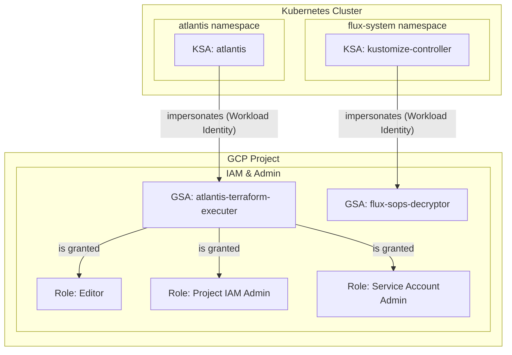

# IAMリソース (サービスアカウントと権限)
このドキュメントは、`terraform/gcp/03-iam/` 配下で管理されている、IAM関連リソースの概要を説明します。

## 概要
このTerraform構成は、主に以下の2つの目的のためのGoogleサービスアカウント(GSA)と、それに関連するIAM権限を設定します。
- **Atlantis:** Terraformコードを自動的に実行するためのサービスアカウント。
- **Flux:** Kubernetesクラスタ内のリソースを管理し、SOPSで暗号化されたシークレットを復号するためのサービスアカウント。

これらのサービスアカウントは、Kubernetesサービスアカウント(KSA)とWorkload Identityを利用して連携し、GCPリソースへの安全なアクセスを実現します。

## リソース関連図

## リソース詳細
### 1. サービスアカウントとWorkload Identity (`iam.tf`)
- **リソース:** `google_service_account`
- **説明:** `for_each`を使用して、2つのGoogleサービスアカウントを作成します。
  - `atlantis-terraform-executer`: AtlantisがGCPリソースを管理するために使用します。
  - `flux-sops-decryptor`: FluxがSOPSで暗号化されたデータを復号するために使用します（例: KMSキーへのアクセス）。
- **リソース:** `google_service_account_iam_member`
- **説明:** 各GoogleサービスアカウントとKubernetesサービスアカウントを紐付け、Workload Identityを有効にします。これにより、Kubernetes Pod内のアプリケーションが、対応するGoogleサービスアカウントとしてGCP APIを認証・認可できるようになります。
  - `atlantis-terraform-executer` (GSA) <--> `atlantis/atlantis` (KSA)
  - `flux-sops-decryptor` (GSA) <--> `flux-system/kustomize-controller` (KSA)

### 2. Atlantis用IAMポリシー (`iam-policy.tf`)
- **リソース:** `google_project_iam_member`
- **説明:** `atlantis-terraform-executer`サービスアカウントに対して、プロジェクトレベルで複数のIAMロールを付与します。これにより、AtlantisはTerraformを通じてプロジェクト内のリソースを広範囲に作成・更新・削除する権限を持ちます。
- **付与されるロール:**
  - `roles/editor` (編集者)
  - `roles/resourcemanager.projectIamAdmin` (プロジェクト IAM 管理者)
  - `roles/iam.serviceAccountAdmin` (サービス アカウント管理者)
