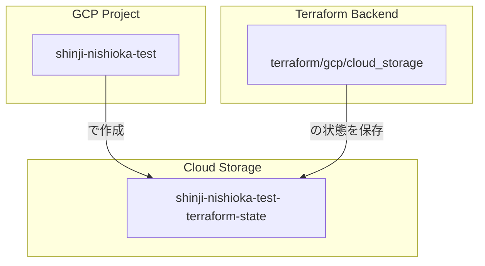

# Cloud Storage バケット
このドキュメントは、`terraform/gcp/cloud_storage/` 配下で管理されている、Terraformの状態を保存するためのGoogle Cloud Storage (GCS) バケットに関するTerraformリソースの概要を説明します。

## 概要
このTerraform構成は、Terraformのバックエンドとして利用されるGCSバケットを作成する役割を担います。このバケットは、Terraformの状態ファイル (`.tfstate`) を一元的に管理し、チームでの共同作業を可能にするために使用されます。

## リソース関連図

## リソース詳細
### 1. GCSバケット (`cloud_storage.tf`)
- **リソース:** `google_storage_bucket`
- **説明:** Terraformの状態ファイルを保存するためのGCSバケットを作成します。バケット名は `shinji-nishioka-test-terraform-state` です。オブジェクトの変更履歴を保持するために、バージョニングが有効化されています。

### 2. バックエンド設定 (`backend.tf`)
- **Terraformバックエンド:** GCS (Google Cloud Storage)
- **バケット:** `shinji-nishioka-test-terraform-state`
- **説明:** このTerraformモジュールの状態ファイル (`.tfstate`) を、同じモジュールで作成されたGCSバケットに保存するよう設定します。これにより、Terraformの実行状態がリモートで一元管理されます。
