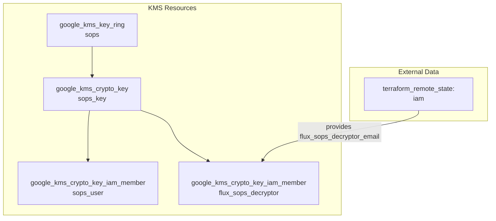

# Cloud KMS
このドキュメントは、`terraform/gcp/kms/` 配下で管理されている、Cloud KMS (Key Management Service) 関連リソースの概要を説明します。

## 概要
このTerraform構成は、主にSOPS (Secrets OPerationS) で利用するGCPのKMSキーリングと暗号鍵を作成します。
作成された暗号鍵には、特定のユーザーと、Flux CDがシークレットを復号化するために使用するサービスアカウントに対して、適切なIAMロールが付与されます。

## リソース関連図

## リソース詳細
### 1. データソース (`data.tf`)
- **リソース:** `google_project`
  - **説明:** 現在のGCPプロジェクトに関する情報を取得します。
- **リソース:** `terraform_remote_state`
  - **説明:** `terraform/gcp/03-iam` モジュールの状態ファイルを参照し、Flux CDがSOPSのシークレットを復号化するために使用するサービスアカウントのメールアドレス (`flux_sops_decryptor_email`) を取得します。

### 2. KMSリソース (`kms.tf`)
- **リソース:** `google_kms_key_ring`
  - **名前:** `sops`
  - **説明:** SOPSで使用する暗号鍵をグループ化するためのキーリングを作成します。
- **リソース:** `google_kms_crypto_key`
  - **名前:** `sops-key`
  - **説明:** `sops` キーリング内に、実際にデータの暗号化・復号化を行うための暗号鍵を作成します。`prevent_destroy` ライフサイクル設定により、誤って鍵が削除されるのを防ぎます。
- **リソース:** `google_kms_crypto_key_iam_member`
  - **説明:** 作成した暗号鍵に対して、以下のIAM権限を付与します。
    - **sops_user:** 特定のユーザー (`s61nov11.shinji.nishioka@gmail.com`) に、鍵の暗号化と復号化の両方を許可する `roles/cloudkms.cryptoKeyEncrypterDecrypter` ロールを付与します。
    - **flux_sops_decryptor:** `data.tf` で取得したサービスアカウントに対し、鍵の復号化のみを許可する `roles/cloudkms.cryptoKeyDecrypter` ロールを付与します。

### 3. バックエンド設定 (`backend.tf`)
- **Terraformバックエンド:** GCS (Google Cloud Storage)
- **バケット:** `shinji-nishioka-test-terraform-state`
- **プレフィックス:** `terraform/gcp/kms`
- **説明:** Terraformの状態ファイル (`.tfstate`) は、指定されたGCSバケットの特定のプレフィックス配下に保存されます。これにより、状態の永続化とチームでの共有が可能になります。
